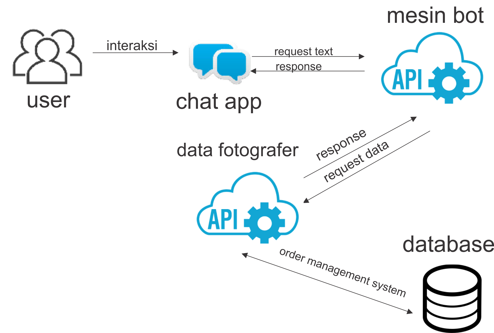

# aplikasi-chatbot
aplikasi chatbot ini menggunakan framework vue + tensorflow + python

## gambaran arsitektur sistem

1. Chat app digunakan utuk mengirim kalimat berupa text ke mesin bot melalui protocol HTTP.
2. Mesin bot digunakan untuk membuat model yang di buat ketika menjalankan server dan menerima text dari chat app untuk menganalisa dan memberikan respons, response yang di hasilkan akan diproses oleh web service REST API dan hasilnya dikirim dalam format objeck JSON.
3. Data fotografer digunakan disaat mesin bot memerlukan data maka REST API akan melakukan permintaan data melalui protocol HTTP dengan memanggil URL tertentu. Kemudian dilakukan pemrosesan permintaan yang telah diberikan kepada sistem. Kemudian melakukan query data di basis data yang terletak pada server, lalu hasil query data diproses oleh web service REST API dan hasilnya dikirim dalam format objeck JSON yang siap dipakai oleh mesin bot.

# PROJEK APLIKASI INI MASIH DALAM TAHAP PENGEMBANGAN
